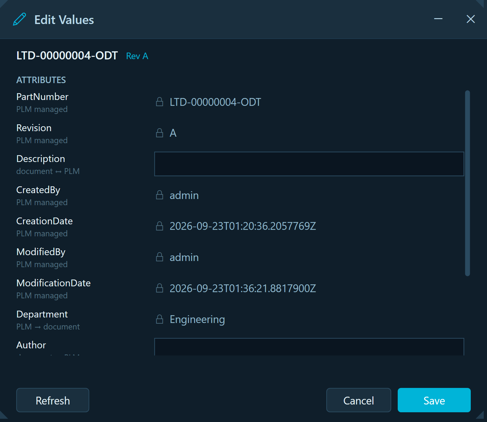
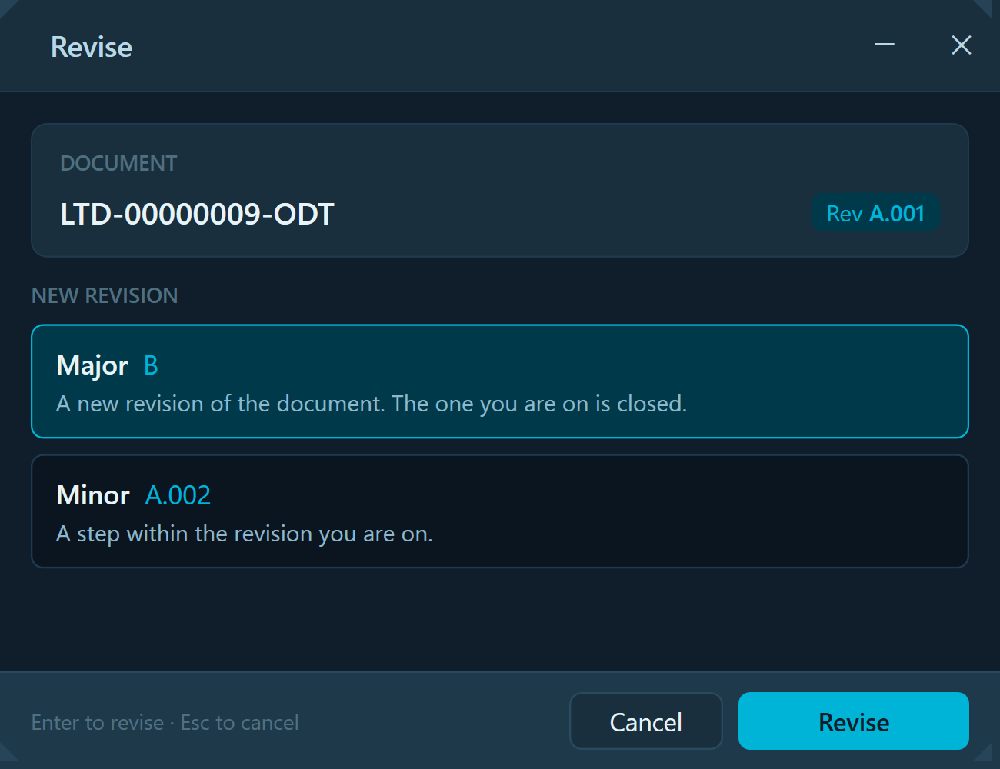
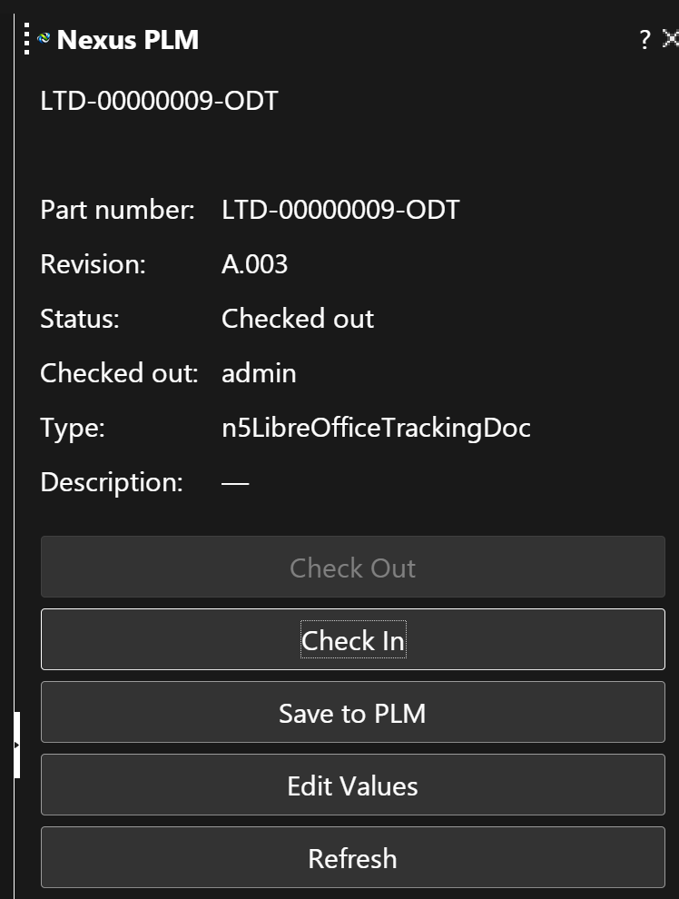

# Nexus PLM for LibreOffice

[](https://github.com/Nexus-PLM/Nexus.PLM.LibreOffice.Addins/actions/workflows/build.yml)
[](LICENSE)

Product lifecycle management from inside LibreOffice. Create a document from a PLM template, check
it out, edit its attributes, check it back in — in Writer, Calc, Impress, Draw and Math, without
leaving the application.


The add-in is a Python UNO extension packaged as an `.oxt`. It talks to the **Nexus PLM Addin
Service** on `localhost:5100`, which owns the dialogs and does the talking to the PLM server — so
the same windows, wording and behaviour appear in LibreOffice, Word, Excel, PowerPoint and FreeCAD.

---

## What it does

Twenty-three commands, on a toolbar, a menu, and stacked dropdowns:

| | |
|---|---|
| **Documents** | New from Template · Open from PLM · Search |
| **Saving** | Save to PLM · Save As New Item · Save As Existing Item |
| **Lifecycle** | Check Out · Check In · Release · Revise · Change Ownership |
| **Workflow** | My Worklist · New Workflow |
| **Values** | Properties · Edit Values · Refresh Values · Reload Document |
| **Session** | Sign In · Sign Out · Current Settings · Connection Status · Help · About |

A document created from a PLM template opens filled in — part number, revision, description,
whoever created it and when — because the type says which PLM attribute feeds which document field.

<p align="center">
  
  
</p>

**Edit Values** (left) shows every mapped attribute and honours the direction the type declares:
a value PLM owns is shown and locked, one the document owns is editable, and identity and audit
fields are never editable whatever a mapping says. **Revise** (right) offers the revisions the
server would actually create, under that type's own revisioning scheme.

### The sidebar



A docked **Nexus PLM** deck, in all five applications, showing what PLM knows about the document in
front of you and offering only the commands its state allows: Check Out is greyed on a document
already checked out to you, Check In and Save on one that is not yours to save.

It is built from LibreOffice's own controls rather than hosting a web view, and that is a measured
decision rather than a preference — see *A sidebar panel is not a window* below.

## How it fits together

```
LibreOffice  ──UNO──►  this extension  ──HTTP──►  Addin Service  ──►  Nexus PLM Engine
 (Writer …)            (Python, .oxt)            (localhost:5100)      Vault, types, workflow
                                                        │
                                   the dialogs a user sees live here,
                                   shared by every host: Word, Excel,
                                   PowerPoint, FreeCAD, LibreOffice
```

The extension keeps no business rules of its own. It says what it is and what it can open — the
service needs no code changes to gain a new host — writes PLM's values into the document, and asks
the service for everything else.

One piece runs on both sides: **`Nexus.PLM.LibreOffice.Templates`**, a small .NET library that
reads and writes OpenDocument metadata over a zip, with no LibreOffice needed. The Vault loads it
server-side to discover what fields a template has; the add-in uses the same rules client-side, so
a value written into an open document and the same value written into a closed one are the same
value.

## Installing

Download `NexusPLM.oxt` from a [release](../../releases) and install it:

```
unopkg add NexusPLM.oxt
```

or double-click it in LibreOffice (**Tools ▸ Extension Manager ▸ Add**). LibreOffice must be
closed when installing from the command line.

You will also need the Nexus PLM Addin Service running locally — it is what the add-in talks to,
and it is what shows the dialogs.

## Building

```bash
# the extension (writes dist/NexusPLM.oxt) — needs only Python 3
python extension/build.py

# build and install in one step; close LibreOffice first
python extension/build.py --install

# the connector and its tests
dotnet test Nexus.PLM.LibreOffice.Templates.Tests

# the add-in's own Python
python -m unittest discover -s tests/python
```

`build.py` refuses to pack an extension whose menus name a command the scripts do not export, or an
icon a mapping does not have — both of which fail silently inside LibreOffice otherwise.

## Repository layout

| | |
|---|---|
| `extension/` | The `.oxt`: manifest, menu and toolbar definitions, icons, and the Python that runs inside LibreOffice. |
| `extension/python/nexus_commands.py` | One function per command — the whole surface a user touches. |
| `extension/python/pythonpath/nexusplm/` | `client.py` (the service), `document.py` (UNO), `odf.py` (the package on disk), `state.py` (which item a file is). |
| `extension/python/nexusplm_controllers.py` | The UNO component behind the toolbar's stacked dropdowns. |
| `extension/python/nexusplm_sidebar.py` | The UNO component behind the docked sidebar deck. |
| `Nexus.PLM.LibreOffice.Templates/` | The ODF connector, .NET, `netstandard2.0` + `net8.0`. |
| `Nexus.PLM.LibreOffice.Templates.Tests/` | 61 tests, including one that makes LibreOffice itself reopen a file the connector rewrote. |
| `tests/python/` | 74 tests over the add-in's own logic — no LibreOffice required. |

## Design notes

Things that cost something to learn, kept here so they are not learned twice.

**One connector for five applications.** Every LibreOffice format is an OpenDocument package, and
all five keep user-defined fields in the same `meta.xml` under the same schema. One implementation
covers Writer, Calc, Impress, Draw and Math, differing only in MIME type and which field kinds a
document can hold.

**A host declares its own capabilities.** What this add-in can open travels with each request, so
adding a host needs no service change. If a host seems to need one, it is usually declaring the
wrong thing.

**The staged file is written before the office opens it.** Values written into a document only
once it is open depend on a later save happening; the file on disk is what Check In uploads, what a
backup captures, and what a colleague opens.

**A template is not a document.** A file staged from a type's template still says it is a template
— in its `mimetype` *and* in its manifest — and an office opens a template by making an untitled
copy and leaving the file alone. Both declarations are corrected before anything opens it.

**One typing rule, shared.** A date, a number and a flag each have one lexical form, written the
same way whether the document is open or closed. `OdfValueWrite` is that rule on the .NET side and
`odf.py` mirrors it exactly.

**A sidebar panel is not a window.** The deck is drawn with UNO controls, not by hosting a browser,
because there is nothing to host one *in*. LibreOffice draws its entire interface itself inside one
top-level window: on 26.2 the frame window hands back a Win32 handle, but the document window and a
child made through the toolkit expose no system-dependent interface at all, and enumerating the
frame's child windows returns **zero**. A panel is a painted rectangle. Parenting a native control
to the frame instead would mean tracking that rectangle by hand — and the frame does not set
`WS_CLIPCHILDREN`, so the office would paint over the control on every repaint. It would also be
Windows-only. The same reasoning is why the toolbar's dropdowns are a UNO toolbar controller.

**Whitespace inside a configuration value is part of the value.** A `ContextList` laid out prettily
across several indented lines comes back with the newline and the indentation still inside it, so
the application name is not `WriterVariants` and nothing ever matches: the deck appears in the rail
and opens empty, with nothing logged. Its entries also each contain commas, so the list separator must
be `;`. Both are checked by `build.py` now, because neither fails loudly.

**Not the .NET/CLI UNO bridge.** It was considered and ruled out on evidence: of the five managed
assemblies it needs, LibreOffice 26.2 ships none. Python UNO is the supported path.

## Contributing

Issues and pull requests are welcome. Please:

- keep a change and its test together — every fix here came from something observed, and the test
  says what was observed;
- run both suites before opening a pull request;
- describe *why* in the commit body, not only what.

The round-trip test that drives LibreOffice reports as **skipped** where LibreOffice is absent,
never as passed — a green tick for an assurance nobody has is worse than no test.

## License

MIT — see [LICENSE](LICENSE).
